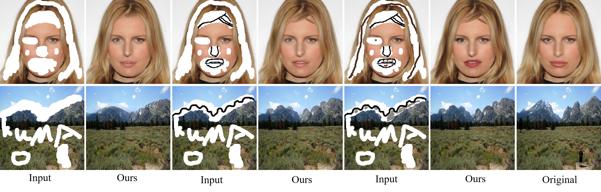
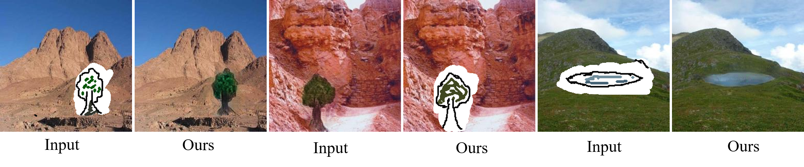

[](./LICENSE.md)

# DeFLOCNet: Deep Image Editing via Flexible Low level Controls (CVPR2021) .The official pytorch code.

###  [Paper](https://openaccess.thecvf.com/content/CVPR2021/papers/Liu_DeFLOCNet_Deep_Image_Editing_via_Flexible_Low-Level_Controls_CVPR_2021_paper.pdf) | [BibTex](#jump2)

[Hongyu Liu](#jump1),  [Ziyu Wan](http://raywzy.com/),  [Wei Huang](#jump1), [Yibing Song](https://ybsong00.github.io/), [Xintong Han](http://users.umiacs.umd.edu/~xintong/)
, [Jing Liao](https://liaojing.github.io/html/), [Bin Jiang](#jump1), [Wei Liu](https://scholar.google.com/citations?user=AjxoEpIAAAAJ&hl=zh-CN).<br>


[//]: # (<video width="960" height="540" controls>)

[//]: # (    <source src="doc/Demo.mp4" type="video/mp4">)

[//]: # (</video>)







## Installation

Clone this repo.
```bash
git clone https://github.com/KumapowerLIU/DeFLOCNet.git
```

Prerequisites
* Python3
* Pytorch >=1.0
* Tensorboard
* Torchvision
* pillow

## Demo
**Please try our GUI demo!** 

You need download the pre-trained model to the checkpoints file, you need put the pre-trained model for Places2 to the `checkpoints/nature` and 
the pre-trained model for CelebA to the `checkpoints/face`. Then you can run the code: `demo.py` to edit the images. We give some example images in
the folder `face_sample` and `nature_sample` respectively. Please see the gif to tell you how to use our GUI!


```bash
git clone https://github.com/KumapowerLIU/DeFLOCNet.git
```


## Dataset Preparation

Original images: We use [Places2](http://places2.csail.mit.edu/), [CelebA](http://mmlab.ie.cuhk.edu.hk/projects/CelebA.html)  datasets. To train a model on the full dataset, download datasets from official websites.

Mask for original image: We use the irregular mask dataset [Liu et al](https://arxiv.org/abs/1804.07723) for the original image (not the color image ). You can download the publically available Irregular Mask Dataset from their [website](http://masc.cs.gmu.edu/wiki/partialconv).

Color images for Places2: we use the  [RTV smooth method](http://www.cse.cuhk.edu.hk/~leojia/projects/texturesep/) to extract the color for Places2. Run generation function [`data/matlab/generate_structre_images.m`](data/matlab/generate_structure_images.m) in your matlab. For example, if you want to generate smooth images for Places2, you can run the following code:

```matlab
generate_structure_images("path to Places2 dataset root", "path to output folder");
```

Color images for face: We follow the [SC-FEGAN](https://arxiv.org/pdf/1902.06838.pdf) to generate the color map for the face by using the median color of segmented areas. 
Sketch images: We follow the [SC-FEGAN](https://arxiv.org/pdf/1902.06838.pdf) to predict the edge by using the HED edge detector.


## Code Structure
- `scripts/train.py`: the entry point for training.
- `scripts/test.py`: the entry point for test.
- `model/DeFLOCNet.py`: defines the loss, model, optimizetion, foward, backward and others.
- `model/network/structure_generation_block.py`: defines the SGB block as mentioned in our paper.
- `config/`: creates option lists using `argparse` package. More individuals are dynamically added in other files as well.
- `data/`: process the dataset before passing to the network.


## Pre-trained weights
There are [two folders](https://drive.google.com/drive/folders/1IU2ZucjIoE_PnwWrhNLjoiHh5_-077zh?usp=sharing) to present a pre-trained model for two datasets, respectively. How to use these pre-train models? Please see the Demo!

## TODO
- [ ] upload the training and testing scripts.

<span id="jump2"></span>
### Citation
If you use this code for your research, please cite our papers.
```
@inproceedings{Liu2021DeFLOCNet},
  title={DeFLOCNet: Deep Image Editing via Flexible Low level Controls},
  author={Hongyu Liu, Ziyu Wan, Wei Huang, Yibing Song, Xintong Han, Jing Liao, Bing Jiang and Wei Liu},
  booktitle={CVPR},
  year={2021}
}